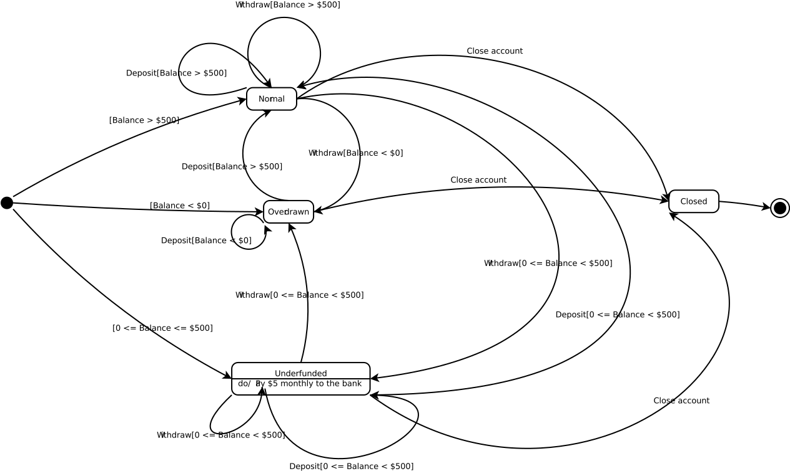

Use cases
=========
##### **Title**
Selecting a piece
##### **Actors**
The current player
##### **Pre-condition**
The game has not ended.
##### **Main path**
1. The player clicks on one of the Brickus pieces on the bottom pane of the game window.
2. The piece clicked is highlighted. After a piece is selected, when the player's mouse cursor enters the game board, the cursor becomes the piece selected.

----------

##### **Title**
Rotating a piece
##### **Actors**
The current player
##### **Pre-condition**
The game has not ended. The player has selected a piece
##### **Main path**
1. The player rotates the mouse wheel in the up/down direction by 1 unit
2. The piece selected rotates clockwisely/counter-clockwisely by 90 degrees.
3. The selected piece in the bottom pane of the game window and the piece representing the mouse cursor in the game board update their graphics when the player rotates the piece. 

----------

##### **Title**
Flipping a piece
##### **Actors**
The current player
##### **Pre-condition**
The game has not ended. The player has selected a piece
##### **Main path**
1. The player clicks the mouse's right button, the piece selected flips horizontally; if the player clicks the mouse's right button while holding the shift key, the piece selected flips vertically.
2. The selected piece in the bottom pane of the game window and the piece representing the mouse cursor in the game board update their graphics when the player flips the piece. 

----------

##### **Title**
Skipping the turn
##### **Actors**
The current player
##### **Pre-condition**
The game has not ended.
##### **Main path**
  1. During a player's turn, the player can click the "pass" button.   
  2. If the opponent just ended his/her turn by placing a piece, the current player's turn ends. The pieces in the bottom pane are replaced by the remaining pieces of the other player and no piece is highlighted in the pane and the mouse cursor does not show the shape of any piece. 
##### **Alternative path**
  2.1. If the opponent just clicked "pass" to skip his/her turn, the game ends. The bottom pane of the remaining pieces is removed from the window, the "pass" button is disabled, and the cursor does not show the shape of any piece. If the two players have the same score, the status bar shows the message "Game over. Game tied."; if the two player have different scores, the status bar shows "Game over. The winner is Player 1" if player 1
has higher score and vice versa.

----------

##### **Title**
Placing a piece
##### **Actors**
The current player
##### **Pre-condition**
The player has selected a piece
##### **Main path**
 1. The player can rotate and flip the selected piece or select another piece or choose to skip the turn at any time before his/her turn ends.  
 2. The player moves the mouse cursor to the position that he/she wants the piece to be placed.
 3. The player clicks the left mouse button.
 4. If the rules of Brickus allows this move, the piece is shown on the position the player chooses and disappears from the bottom pane of the window. The player's score on the status bar updates according to the number of grids of the placed piece. The pieces in the bottom pane are replaced by the remaining pieces of the other player and no piece is highlighted in the pane and the mouse cursor does not show the shape of any piece. The current player's turn ends.
##### **Alternative path**
 4.1. If the rules of Brickus do not allow this move, the player cannot place the piece on the board and the status bar shows the message explaining why this move is invalid. The player needs to continue to place a piece or skip the turn.  
State diagram
=============

